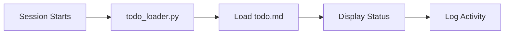
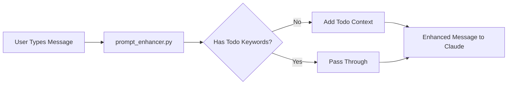
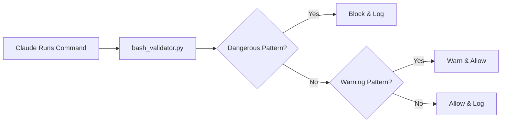
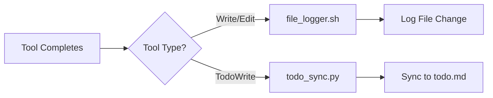
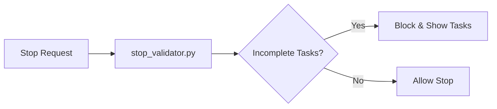

# Claude Code Hooks Architecture

## Overview

The Claude Code Hooks system provides automated behaviors and validations that run at specific points during your interaction with Claude. This architecture document describes the technical implementation following DRY (Don't Repeat Yourself) principles.

## System Components

### Core Architecture

```
.claude/
├── settings.json           # Hook event registration
├── hooks/
│   ├── hook_utils.py      # Shared utility library (DRY)
│   ├── config.json        # Centralized configuration
│   ├── activity.log       # Audit log
│   │
│   ├── bash_validator.py  # Command validation hook
│   ├── stop_validator.py  # Stop event validator
│   ├── todo_loader.py     # Todo context loader
│   ├── prompt_enhancer.py # Prompt enhancement hook
│   ├── todo_sync.py       # Todo synchronization
│   └── file_logger.sh     # File change logging
```

## Shared Utilities Module (`hook_utils.py`)

The cornerstone of our DRY architecture, this module consolidates ~268 lines of previously duplicated code into ~200 lines of reusable functions.

### Key Functions

#### Path Management
```python
get_project_dir() -> str          # Get CLAUDE_PROJECT_DIR
get_activity_log_path() -> str    # Path to activity.log
get_todo_file_path() -> str       # Path to todo.md
get_config_path() -> str          # Path to config.json
```

#### Configuration
```python
load_config() -> Dict[str, Any]   # Load config.json settings
```

#### Hook I/O
```python
read_hook_input() -> Dict         # Read JSON from stdin
exit_allow(message: str)          # Exit code 0 (allow)
exit_block(message: str)          # Exit code 2 (block)
```

#### Logging
```python
log_activity(message: str, activity_type: str)  # Centralized logging
```

#### Todo Management
```python
read_todo_tasks() -> Tuple[List, List]          # Read todo.md
write_todo_file(incomplete: List, completed: List) -> bool
get_todo_summary() -> Dict                      # Get task statistics
format_todo_for_claude() -> str                 # Format for AI context
```

#### Pattern Matching
```python
check_pattern_match(text: str, patterns: List[str]) -> Tuple[bool, Optional[str]]
```

## Hook Event Flow

### 1. SessionStart


### 2. UserPromptSubmit


### 3. PreToolUse (Bash)


### 4. PostToolUse


### 5. Stop


## Configuration System

### `config.json` Structure

```json
{
  "paths": {
    "activity_log": ".claude/hooks/activity.log",
    "todo_file": "todo.md"
  },
  "bash_validator": {
    "dangerous_patterns": [...],
    "warning_patterns": [...]
  },
  "stop_validator": {
    "enforce_todos": true
  },
  "todo_sync": {
    "auto_sync_enabled": true
  }
}
```

### Configuration Loading

Each hook loads configuration on startup:
```python
config = load_config()
hook_config = config.get('hook_name', {})
```

## Hook Registration (`settings.json`)

### Standard Format
```json
{
  "hooks": {
    "EventName": [
      {
        "matcher": "ToolPattern",  // Optional
        "hooks": [
          {
            "type": "command",
            "command": "python3 \"$CLAUDE_PROJECT_DIR\"/.claude/hooks/hook_name.py"
          }
        ]
      }
    ]
  }
}
```

## Data Flow

### Input Processing
1. Claude sends JSON to hook's stdin
2. Hook calls `read_hook_input()`
3. Hook processes data
4. Hook exits with appropriate code

### Output Channels
- **stdout**: Reserved for hook system
- **stderr**: User-visible messages
- **Exit codes**:
  - 0: Allow operation
  - 2: Block operation

## Activity Logging

All hooks log to a centralized activity.log:

```
[2024-01-15 10:30:45] INFO: Session started with 3 pending tasks
[2024-01-15 10:31:02] BLOCKED: Bash: rm -rf /
[2024-01-15 10:32:15] INFO: Todo sync: 5 pending, 2 done
```

## Performance Optimizations

### Code Reduction
- **Before**: 5 hooks × ~100 lines = 500+ lines
- **After**: 5 hooks × ~50 lines + 200 shared = 450 lines
- **Reduction**: ~40% less code

### Execution Speed
- Shared utilities loaded once per execution
- Configuration cached in memory
- Regex patterns compiled on first use

## Security Considerations

### Fail-Open Strategy
All hooks use fail-open (allow on error) to prevent blocking Claude:
```python
except Exception as e:
    print(f"Error: {e}", file=sys.stderr)
    exit_allow()  # Don't block on errors
```

### Command Validation
Dangerous commands blocked by default patterns:
- System destruction (`rm -rf /`)
- Fork bombs
- Direct disk writes
- Remote code execution

## Testing Hooks

### Manual Testing
```bash
# Test todo loader
python3 .claude/hooks/todo_loader.py --format json

# Test with mock input
echo '{"tool_input": {"command": "rm -rf /"}}' | python3 .claude/hooks/bash_validator.py
```

### Validation Checklist
- [ ] Hook loads without errors
- [ ] Correctly reads stdin JSON
- [ ] Logs to activity.log
- [ ] Returns correct exit code
- [ ] Handles missing config gracefully

## Adding New Hooks

### Template
```python
#!/usr/bin/env python3
"""Hook description."""
import sys
from hook_utils import (
    read_hook_input,
    log_activity,
    exit_allow,
    exit_block,
    load_config
)

def main():
    """Main hook execution."""
    config = load_config()
    hook_config = config.get('hook_name', {})

    input_data = read_hook_input()

    # Hook logic here

    log_activity("Action taken", "INFO")
    exit_allow()

if __name__ == "__main__":
    try:
        main()
    except Exception as e:
        print(f"Error: {e}", file=sys.stderr)
        exit_allow()
```

## Troubleshooting

### Common Issues

1. **Hook not triggering**
   - Check settings.json registration
   - Verify Python path
   - Check file permissions

2. **Import errors**
   - Ensure hook_utils.py exists
   - Check Python version (3.6+)

3. **Configuration not loading**
   - Verify config.json syntax
   - Check file permissions

### Debug Mode
Add debug output to hooks:
```python
import os
if os.environ.get('HOOK_DEBUG'):
    print(f"Debug: {variable}", file=sys.stderr)
```

## Future Enhancements

### Planned Features
1. Hook dependency management
2. Async hook execution
3. Hook performance metrics
4. Web-based configuration UI
5. Hook marketplace/sharing

### Architecture Evolution
- Plugin system for third-party hooks
- Hook chaining and composition
- Conditional execution rules
- Remote hook repository